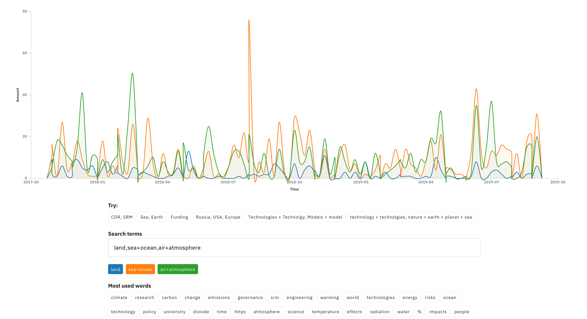

# anci Temporal Topic Plotter
## Quantitative Data Visualisation of term usage in the Geoenergeering mailing list
This tool is a result of the [https://interface.fh-potsdam.de/anci/](anci) hackathon, which took place 10–11.9 at the [https://www.fh-potsdam.de/](Potsdam University of Applied Sciences). The tool visualises the cumulative frequency of nouns that members use in the public [https://groups.google.com/forum/#!forum/geoengineering](geoengineering mailing list) in the time between 26.10.2017 and 9.9.2019.

### Intention
The visualisation is one graphical result of the quantitative analysis of the dataset. It should help to spot patterns in the discussion of certain topics. We use the frequency of nouns as indicators for trends.

### Data collection
We exported the 1823 emails from Apple Mail in the mbox format. From there we used the open-source script [https://github.com/brysonian/mbox-to-json](mbox-to-json) by [https://github.com/brysonian](Chandler McWilliams) to convert it to a JSON file.<br />In the next step, we wrote a Ruby script to extract the relevant mail content. That includes the sender’s address, the date, the subject and of course the text. The goal was to extract only the relevant text. This excludes old, quoted emails, signatures and information for unsubscribing. This was difficult and is most likely not done exhaustively and infallibly. This has several reasons: Most emails were written in HTML that is formatted differently by every mail program and not done properly. For example, signatures do not have a specific class and quotes are not always wrapped in block quote tags. Another reason is that people composite mails differently. Some people quote inline, some people above or below the previous text.<br />During this step, we also extracted all [https://geoengineering-anci.netlify.com/data/links-with-base.csv](links) and images from the mails. We exported these two lists and the list of mails as CSV files.<br />In the next step, we used the open-source script [https://github.com/yohasebe/engtagger](engtagger) by [https://github.com/yohasebe](Yoichiro Hasebe) to extract the nouns. This, again, is a source of error as the list of extracted nouns already shows some false results. The used script is also not able to categorise »technology« and »technologies« as the same word. This will be fixed later in the interface. In this step, we created a list of [https://geoengineering-anci.netlify.com/data/most-used-words.csv](most used words) and a list of [https://geoengineering-anci.netlify.com/data/words_by_month.json](word frequency by month).

### Data analysis
By manually analysing the [https://geoengineering-anci.netlify.com/data/most-active-users.csv](list of authors), we could already find out that the dataset is biased. Out of the 1822 mails in total 727 were written by one author.<br />The analysis of the links gives a good overview of the referenced material. Websites like tandfonline.com, nature.com, scholar.google.com, wiley.com and springer.com are mostly linked to.

### Data visualisation
In the next step, we build a microsite with [https://github.com/vuejs/vue](Vue) ([https://github.com/nuxt/nuxt.js](Nuxt)) and [https://github.com/d3/d3](D3). In the interactive visualisation, the user can select one or more nouns that are then plotted over time. The line chart shows the cumulative frequency of each word. The user can also combine multiple nouns to one chart so that »technologies« and »technology« are counted as one. Besides, the visualisation and the input filed the interface holds buttons with suggestions and the 50 most used nouns.



https://geoengineering-anci.netlify.com/

## Used tools
- https://github.com/yohasebe/engtagger
- http://zeto.io/facet/
- https://github.com/brysonian/mbox-to-json

## Build Setup

``` bash
# install dependencies
$ npm install # Or yarn install

# serve with hot reload at localhost:3000
$ npm run dev

# build for production and launch server
$ npm run build
$ npm start

# generate static project
$ npm run generate
```
